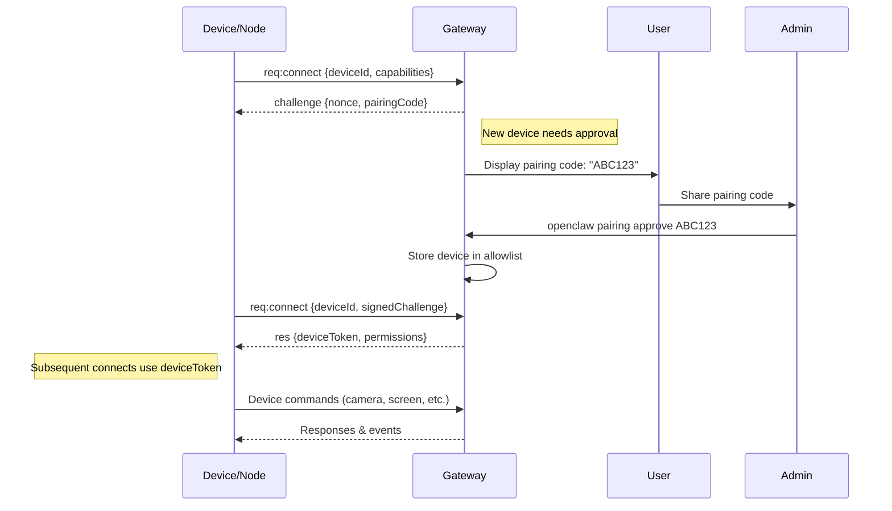

# OpenClaw Architecture Analysis & System Design

## 🎯 Executive Summary
OpenClaw is a **personal AI assistant** that runs on your own infrastructure, providing **multi-channel messaging integration** with **comprehensive tool access** while maintaining **security-first design principles**.

**Core Innovation**: Single Gateway control plane that normalizes 10+ messaging platforms into a unified AI interaction surface.

---

## 📋 Architecture Overview

```
┌─────────────────────────────────────────────────────────────────────────────────────┐
│                                   USER DEVICES                                        │
├─────────────────────────────────────────────────────────────────────────────────────┤
│  📱 WhatsApp    📞 Telegram    💬 Slack    🎮 Discord    📧 Gmail    💼 Teams       │
│  📱 Signal      🍎 iMessage    🔵 Matrix   🌐 WebChat   📋 CLI      🖥️ macOS App    │
└─────────────────────┬───────────────────────────────────────────────────────────────┘
                      │ Multiple Transport Protocols
                      │ (Baileys, grammY, Bolt, discord.js, etc.)
                      ▼
┌─────────────────────────────────────────────────────────────────────────────────────┐
│                                OPENCLAW GATEWAY                                       │
│                           📍 ws://127.0.0.1:18789                                   │
├─────────────────────────────────────────────────────────────────────────────────────┤
│                                                                                     │
│  ┌─────────────────┐  ┌─────────────────┐  ┌─────────────────┐  ┌─────────────────┐ │
│  │  CHANNEL LAYER  │  │   ACCESS CTRL   │  │  SESSION MGR    │  │   TOOL ENGINE   │ │
│  │                 │  │                 │  │                 │  │                 │ │
│  │ • WhatsApp      │  │ • DM Pairing    │  │ • Multi-Agent   │  │ • Sandboxing    │ │
│  │ • Telegram      │  │ • Allowlists    │  │ • Session Trees │  │ • Browser Ctrl  │ │
│  │ • Discord       │  │ • Device Auth   │  │ • Context Mgmt  │  │ • File System   │ │
│  │ • Signal        │  │ • Token/PWD     │  │ • Persistence   │  │ • Shell Access  │ │
│  │ • + 6 more      │  │ • Group Policy  │  │ • Queue Modes   │  │ • Node Commands │ │
│  └─────────────────┘  └─────────────────┘  └─────────────────┘  └─────────────────┘ │
│                                                                                     │
├─────────────────────────────────────────────────────────────────────────────────────┤
│                              WEBSOCKET API LAYER                                     │
│  ┌─────────────────────────────────────────────────────────────────────────────┐   │
│  │  Protocol: {type:"req", id, method, params} → {type:"res", id, ok, payload}  │   │
│  │  Events: {type:"event", event, payload, seq, stateVersion}                   │   │
│  └─────────────────────────────────────────────────────────────────────────────┘   │
└─────────────────────┬───────────────────────────────────────────────────────────────┘
                      │ WebSocket Connections
                      ▼
┌─────────────────────────────────────────────────────────────────────────────────────┐
│                                  AI RUNTIME                                          │
├─────────────────────────────────────────────────────────────────────────────────────┤
│  ┌─────────────────┐  ┌─────────────────┐  ┌─────────────────┐  ┌─────────────────┐ │
│  │   PI-AGENT      │  │  MODEL LAYER    │  │   SKILLS MGR    │  │  AUTOMATION     │ │
│  │                 │  │                 │  │                 │  │                 │ │
│  │ • RPC Runtime   │  │ • Claude/GPT    │  │ • Skill Registry│  │ • Cron Jobs     │ │
│  │ • Tool Stream   │  │ • Auth Profiles │  │ • Hot Reload    │  │ • Webhooks      │ │
│  │ • Block Stream  │  │ • Failover      │  │ • Dependencies  │  │ • Gmail PubSub  │ │
│  │ • Queue Serial  │  │ • Usage Track   │  │ • ClawHub       │  │ • Wake Events   │ │
│  └─────────────────┘  └─────────────────┘  └─────────────────┘  └─────────────────┘ │
└─────────────────────┬───────────────────────────────────────────────────────────────┘
                      │ Commands & Responses
                      ▼
┌─────────────────────────────────────────────────────────────────────────────────────┐
│                                COMPANION NODES                                       │
├─────────────────────────────────────────────────────────────────────────────────────┤
│  📱 iOS Node     🤖 Android Node    🖥️ macOS App     🌐 Control UI    ⌨️ CLI       │
│  • Canvas        • Canvas           • Menu Bar       • Web Admin      • Direct      │
│  • Voice Wake    • Camera           • Voice Wake     • WebChat        • Commands    │
│  • Camera        • Screen Record    • PTT Overlay    • Dashboard      • Scripts     │
│  • Location      • Notifications    • System Cmds    • Live Logs      • Debugging   │
└─────────────────────────────────────────────────────────────────────────────────────┘
```

---

## 🔄 User Interaction Flow (Detailed)

### Message Flow: WhatsApp Example
```
1. 📱 User sends "Help me debug this code"
   ↓ [WhatsApp servers → Baileys WebSocket]
   
2. 🌐 Baileys fires onMessage event
   ↓ [Channel-specific protocol handling]
   
3. 🏗️ Gateway Router normalizes:
   {
     channel: "whatsapp",
     peer: "+1234567890", 
     text: "Help me debug this code",
     sessionKey: "main:whatsapp:dm:+1234567890"
   }
   ↓ [InboundEnvelope created]
   
4. 🔐 Access Control Check:
   - Is +1234567890 in allowFrom? ✅
   - DM policy = "pairing"? ✅  
   - Device paired and approved? ✅
   ↓ [Authorization passed]
   
5. 🎯 Route to Agent:
   - Resolve session (create if new)
   - Load session context & skills
   - Queue serialization per session
   ↓ [Session prepared]
   
6. 🤖 AI Processing:
   - Build system prompt + context
   - Stream to Claude/GPT via RPC
   - Execute tools if needed
   - Generate response stream
   ↓ [Response generated]
   
7. 📤 Response Delivery:
   - Baileys sends via WhatsApp WS
   - WebSocket clients get live updates
   - Session persistence
   ↓ [Multi-channel delivery]
   
8. 👁️ Live Monitoring:
   Gateway pushes event: {
     "type": "event",
     "event": "chat", 
     "data": {
       "channel": "whatsapp",
       "text": "Looking at your code...",
       "sessionKey": "main:whatsapp:dm:+1234567890"
     }
   }
```

---

## 🔐 Authentication & Pairing Flow

### Device Pairing Sequence


### Multi-Layer Security Model
```
┌─────────────────────────────────────────┐
│           SECURITY LAYERS               │
├─────────────────────────────────────────┤
│ 🔴 Network Layer                        │
│   • Loopback bind (127.0.0.1)         │
│   • Tailscale Serve/Funnel            │
│   • TLS + Certificate Pinning         │
├─────────────────────────────────────────┤
│ 🟡 Gateway Authentication              │
│   • Token/Password required           │
│   • Device identity verification      │
│   • Pairing approval workflow         │
├─────────────────────────────────────────┤
│ 🟠 Channel Authorization               │
│   • DM Policy (pairing/allowlist/open)│
│   • Group allowlists & mention gating │
│   • Per-channel access controls       │
├─────────────────────────────────────────┤
│ 🟢 Agent & Tool Security              │
│   • Sandboxed execution (Docker)      │
│   • Per-agent tool allowlists         │
│   • Elevated permission controls      │
├─────────────────────────────────────────┤
│ 🔵 Data Protection                     │
│   • Session isolation                 │
│   • Credential encryption             │
│   • Log redaction & retention         │
└─────────────────────────────────────────┘
```

---

## 🏗️ Core Modules & Functionality

### 1. **Gateway Controller** (Central Nervous System)
- **Purpose**: Single control plane for all surfaces
- **Key Innovation**: WebSocket-first architecture eliminates polling
- **Responsibilities**:
  - Channel protocol normalization
  - Session lifecycle management  
  - Real-time event streaming
  - Device pairing & auth
  - HTTP surfaces (Control UI, Canvas)

### 2. **Channel Abstraction Layer** (Protocol Unification)
- **Purpose**: Normalize 10+ messaging platforms into unified interface
- **Supported Channels**: WhatsApp, Telegram, Discord, Slack, Signal, iMessage, Teams, Matrix, Zalo, WebChat
- **Smart Design**: Each channel plugin implements standard interface:
  ```typescript
  interface ChannelPlugin {
    onMessage(envelope: InboundEnvelope): void
    sendMessage(envelope: OutboundEnvelope): Promise<void>
    getCapabilities(): ChannelCapabilities
  }
  ```

### 3. **Multi-Agent Session Manager** (Context Intelligence)
- **Purpose**: Intelligent session routing and context management
- **Features**:
  - **Session Trees**: Parent → child agent spawning
  - **Isolation Modes**: per-user, per-channel, global
  - **Queue Serialization**: Prevents race conditions
  - **Context Windows**: Smart memory management

### 4. **Security-First Tool Engine** (Controlled Capabilities)
- **Purpose**: Safe execution of powerful operations
- **Sandboxing**: Docker-based isolation per agent
- **Tool Categories**:
  - **File System**: read, write, edit (workspace-scoped)
  - **Execution**: shell commands, process management
  - **Browser**: CDP-based web automation
  - **Network**: HTTP requests, API calls  
  - **Device**: camera, screen recording, notifications
  - **Platform**: Canvas rendering, A2UI

### 5. **Skills Platform** (Extensibility)
- **Purpose**: Dynamic capability loading and management
- **Features**:
  - Hot-reload capability discovery
  - Dependency management
  - ClawHub registry integration
  - Per-agent skill profiles

---

## 💡 Smart Design Patterns

### 1. **WebSocket-First Architecture**
**Why Smart**: Traditional polling wastes resources and creates latency
**Implementation**: Single WS endpoint multiplexes all client types
**Benefits**:
- Real-time bidirectional communication
- Live event streaming (chat, presence, health)
- Efficient resource utilization
- Consistent protocol across all clients

### 2. **Protocol Normalization Pattern**
**Why Smart**: Avoids N×M complexity (N agents × M channels)
**Implementation**: 
```typescript
// All channels produce this standard format
interface InboundEnvelope {
  channel: string
  peer: string  
  text: string
  sessionKey: string
  attachments?: Attachment[]
}
```
**Benefits**:
- Single AI processing pipeline
- Channel-agnostic features
- Easy to add new platforms
- Consistent user experience

### 3. **Security-by-Design Architecture**
**Why Smart**: AI + shell access = high risk; security must be foundational
**Implementation**:
- **Fail-closed defaults**: Pairing required, tools sandboxed
- **Layered authorization**: Network → Gateway → Channel → Agent → Tool
- **Least privilege**: Per-agent tool allowlists
**Benefits**:
- Prevents prompt injection attacks
- Limits blast radius
- Audit trail for all actions

### 4. **Agent-to-Agent Communication**
**Why Smart**: Complex tasks need coordination without user context switching
**Implementation**:
```javascript
// Spawn specialized agent for task
sessions_spawn({
  task: "Analyze security logs and create incident report",
  agentId: "security-analyzer", 
  cleanup: "keep"
})
```
**Benefits**:
- Task specialization
- Parallel processing
- Context preservation
- Reduces main session noise

### 5. **Device Node Federation**
**Why Smart**: Extends capabilities to mobile devices without requiring full AI stack
**Implementation**:
- Lightweight nodes expose device capabilities
- Commands proxied through Gateway
- Unified API regardless of device location
**Benefits**:
- Battery efficiency (AI runs on server)
- Consistent capabilities across devices
- Secure command channeling

### 6. **Event-Driven Plugin System**
**Why Smart**: Extensibility without core modifications
**Implementation**:
```typescript
// Hooks into agent lifecycle
plugin.hooks.register('before_tool_call', (params) => {
  // Log, modify, or deny tool execution
  return modifiedParams
})
```
**Benefits**:
- Third-party extensibility
- Audit and compliance hooks
- Custom business logic injection

---

## 🎯 System Design Interview Key Points

### **Scalability Considerations**
1. **Single Gateway per Host**: Avoids WhatsApp multi-session issues
2. **Session Queuing**: Prevents race conditions, enables safe concurrency
3. **Stateless Design**: Sessions persist to disk, Gateway is replaceable
4. **Docker Sandboxing**: Isolates tool execution, enables multi-tenancy

### **Reliability & Fault Tolerance**
1. **Graceful Degradation**: Channels can fail independently
2. **Model Failover**: Automatic fallback between AI providers
3. **Persistent Sessions**: Survive Gateway restarts
4. **Circuit Breakers**: Rate limiting and error handling

### **Security Architecture** 
1. **Zero Trust**: Every connection requires authentication
2. **Defense in Depth**: Multiple security layers
3. **Audit Trail**: All actions logged with attribution
4. **Sandboxed Execution**: Tools run in isolated containers

### **Performance Optimizations**
1. **WebSocket Multiplexing**: Single connection per client
2. **Event Streaming**: Real-time updates without polling  
3. **Smart Context Management**: LRU eviction and compaction
4. **Skill Caching**: Hot-reload without restart

---

## 🚀 Production Considerations

### **Deployment Patterns**
- **Personal**: Single user, local Gateway
- **Family**: Multi-agent, shared Gateway  
- **Enterprise**: Remote Gateway, node federation
- **Cloud**: Docker-based, Tailscale networking

### **Monitoring & Observability**
- **Health Endpoints**: `/health` for uptime checks
- **Usage Tracking**: Token consumption, API costs
- **Session Analytics**: Performance and error rates
- **Security Auditing**: Access patterns and violations

Your understanding of the flow is **100% accurate**! This architecture brilliantly solves the "personal AI assistant" problem while maintaining security, scalability, and usability.

**Best Design Aspects for Interview Discussion**:
1. **Protocol normalization** eliminates complexity
2. **WebSocket-first** enables real-time collaboration
3. **Security-by-design** makes it production-ready
4. **Agent federation** enables task specialization
5. **Node architecture** extends capabilities efficiently